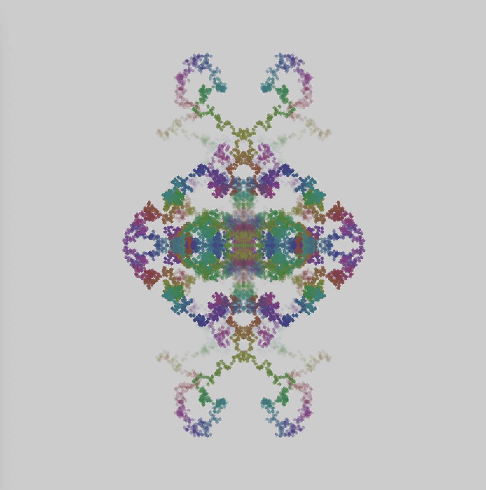
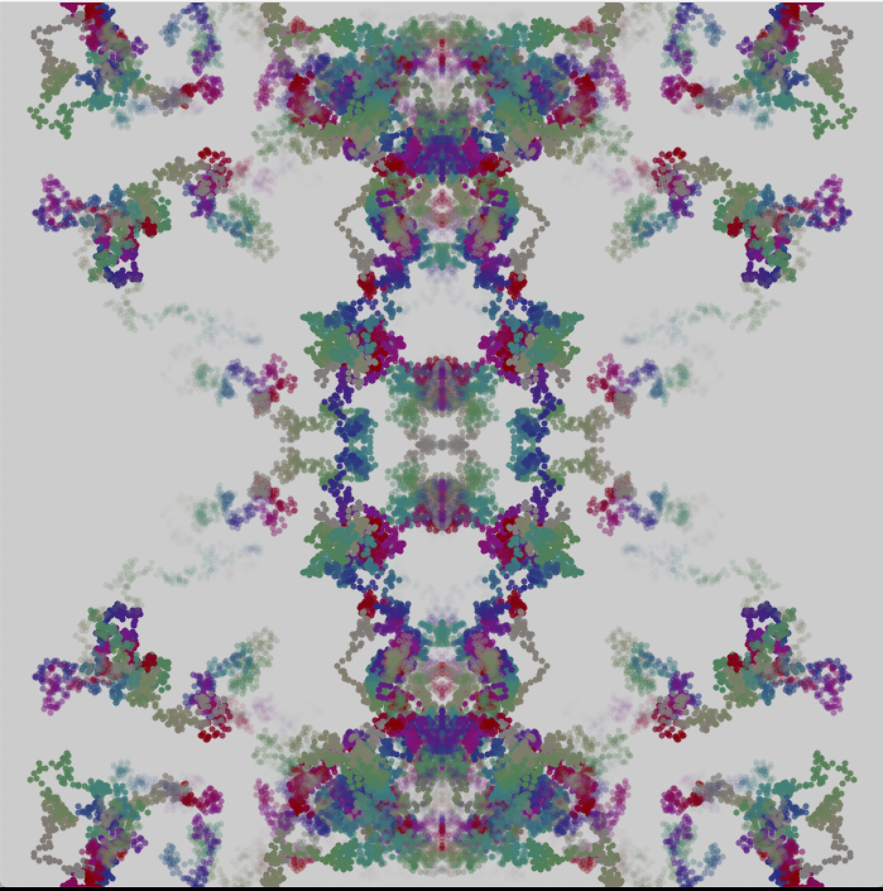

# graphics

A Quil sketch designed to ... well, that part is up to you.

## Usage

LightTable - open `core.clj` and press `Ctrl+Shift+Enter` to evaluate the file.

Emacs - run cider, open `core.clj` and press `C-c C-k` to evaluate the file.

REPL - run `(require 'graphics.core)`.

## License

Copyright © 2016 FIXME

Distributed under the Eclipse Public License either version 1.0 or (at
your option) any later version.
